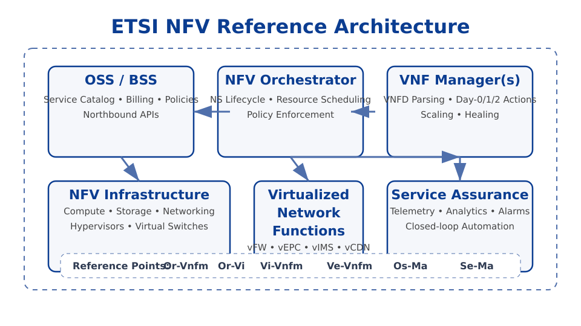
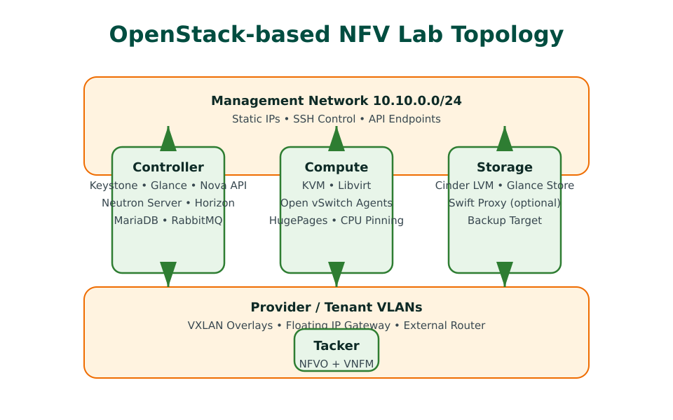
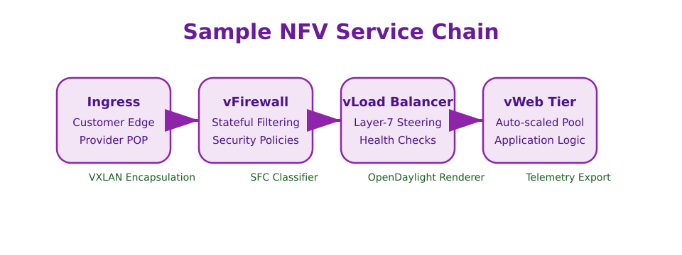

# Network Function Virtualization Research and Experimental Deployment

**Authors:** Trần Thành Công – Nguyễn Đức Duy  \
**Program:** Bachelor of Computer and Communications Engineering, Faculty of Information Technology, University of Science – VNU HCMC  \
**Academic year:** 2013 – 2017

## Abstract
Network Function Virtualization (NFV) decouples network services from proprietary hardware appliances by running virtualized network functions (VNFs) on a flexible pool of computing, storage, and networking resources. This thesis surveys the origins of NFV, analyses the ETSI NFV architectural framework, and documents the construction of a small-scale NFV testbed on top of OpenStack. The experimental environment demonstrates automated provisioning of virtual network functions through the Tacker orchestrator, integrates software-defined networking (SDN) controllers for service chaining, and evaluates the benefits and challenges of NFV for service providers.

## Table of Contents
- [Abstract](#abstract)
- [Chapter 1. Introduction](#chapter-1-introduction)
  - [1.1 Motivation](#11-motivation)
  - [1.2 Objectives](#12-objectives)
  - [1.3 Scope and Approach](#13-scope-and-approach)
  - [1.4 Thesis Structure](#14-thesis-structure)
  - [1.5 Research Questions](#15-research-questions)
  - [1.6 Methodology](#16-methodology)
- [Chapter 2. Foundations of Network Function Virtualization](#chapter-2-foundations-of-network-function-virtualization)
  - [2.1 Virtualization and Cloud Computing Overview](#21-virtualization-and-cloud-computing-overview)
  - [2.2 Benefits of NFV](#22-benefits-of-nfv)
  - [2.3 NFV Development History](#23-nfv-development-history)
  - [2.4 NFV Architectural Framework](#24-nfv-architectural-framework)
    - [2.4.1 Management and Orchestration Components](#241-management-and-orchestration-components)
    - [2.4.2 NFVI Resource Pools](#242-nfvi-resource-pools)
    - [2.4.3 Reference Points](#243-reference-points)
  - [2.5 NFV and SDN Convergence](#25-nfv-and-sdn-convergence)
  - [2.6 Open-Source NFV Ecosystem](#26-open-source-nfv-ecosystem)
  - [2.7 NFV Use Cases](#27-nfv-use-cases)
  - [2.8 Challenges and Research Directions](#28-challenges-and-research-directions)
- [Chapter 3. Building an NFV Test Environment on OpenStack](#chapter-3-building-an-nfv-test-environment-on-openstack)
  - [3.1 Laboratory Environment](#31-laboratory-environment)
    - [3.1.1 Physical Topology](#311-physical-topology)
    - [3.1.2 Network Segmentation](#312-network-segmentation)
  - [3.2 OpenStack Deployment Steps](#32-openstack-deployment-steps)
    - [3.2.1 Base Operating System Preparation](#321-base-operating-system-preparation)
    - [3.2.2 Controller Node Services](#322-controller-node-services)
    - [3.2.3 Compute Node Hardening](#323-compute-node-hardening)
    - [3.2.4 Storage and Image Services](#324-storage-and-image-services)
    - [3.2.5 Post-deployment Validation](#325-post-deployment-validation)
  - [3.3 Installing and Configuring Tacker](#33-installing-and-configuring-tacker)
  - [3.4 SDN Controller Integration](#34-sdn-controller-integration)
    - [3.4.1 Control Plane Synchronization](#341-control-plane-synchronization)
    - [3.4.2 Troubleshooting Workflow](#342-troubleshooting-workflow)
  - [3.5 Sample VNFs and Service Chains](#35-sample-vnfs-and-service-chains)
    - [3.5.1 Descriptor Structure](#351-descriptor-structure)
    - [3.5.2 Day-2 Operations](#352-day-2-operations)
  - [3.6 Challenges Encountered](#36-challenges-encountered)
  - [3.7 Operational Procedures](#37-operational-procedures)
    - [3.7.1 Change Management](#371-change-management)
    - [3.7.2 Monitoring and Alerting Stack](#372-monitoring-and-alerting-stack)
- [Chapter 4. Evaluation and Discussion](#chapter-4-evaluation-and-discussion)
  - [4.1 Validation Scenarios](#41-validation-scenarios)
  - [4.2 Observations](#42-observations)
  - [4.3 Quantitative Results](#43-quantitative-results)
  - [4.4 Lessons Learned](#44-lessons-learned)
  - [4.5 Limitations](#45-limitations)
  - [4.6 Discussion of Business Implications](#46-discussion-of-business-implications)
- [Chapter 5. Conclusion and Future Work](#chapter-5-conclusion-and-future-work)
  - [5.1 Contribution Summary](#51-contribution-summary)
  - [5.2 Recommendations for Practitioners](#52-recommendations-for-practitioners)
- [References](#references)

## Chapter 1. Introduction
### 1.1 Motivation
Telecommunications networks have traditionally relied on vendor-specific middleboxes that are costly to deploy, difficult to scale, and slow to innovate. The emergence of cloud computing and server virtualization shows that software-driven infrastructure can improve agility and cost-effectiveness. NFV extends this idea to networking by virtualizing firewalls, load balancers, EPC gateways, and other functions so that service providers can roll out new offerings quickly without purchasing bespoke hardware.

### 1.2 Objectives
The thesis pursues three goals:
1. Summarize the evolution of NFV and the terminology defined by the European Telecommunications Standards Institute (ETSI).
2. Analyse the NFV architectural framework, focusing on the NFV Infrastructure (NFVI) and the Management and Orchestration (MANO) stack.
3. Deploy and validate a proof-of-concept NFV environment using open-source software to illustrate how VNFs can be instantiated, managed, and chained together.

### 1.3 Scope and Approach
The investigation concentrates on infrastructure-level technologies that underpin NFV in data centres. Hardware acceleration techniques, commercial MANO products, and carrier-grade operational concerns are out of scope. The practical work relies exclusively on open-source components: Ubuntu Server, OpenStack Ocata, Open vSwitch, and Tacker. Integration with SDN controllers is explored using OpenDaylight where possible.

### 1.4 Thesis Structure
Chapter 2 presents foundational concepts such as virtualization models, cloud services, and the ETSI NFV reference architecture. Chapter 3 details the laboratory setup, installation steps, and orchestration workflow. Chapter 4 reports on experiments, observations, and limitations. Chapter 5 concludes with lessons learned and future directions.

### 1.5 Research Questions
The thesis addresses the following guiding questions:
- **How can open-source infrastructure replicate carrier-grade NFV capabilities?** We examine whether commodity hardware paired with community software can deliver the orchestration, networking, and lifecycle controls typically associated with proprietary systems.
- **Which integration points create the highest operational friction?** The work documents issues found between OpenStack services, Tacker components, and the SDN controller to highlight where standards and tooling still mature.
- **What benefits and trade-offs emerge when service providers adopt NFV?** We analyse cost models, deployment agility, and operational complexity to outline business and technical implications.

### 1.6 Methodology
The research combined literature study, hands-on experimentation, and iterative validation:
1. **Document analysis:** ETSI specifications, project documentation, and industry white papers informed the conceptual understanding of NFV trends.
2. **Laboratory prototyping:** The team provisioned a small cluster, repeatedly deploying and tearing down NFV components to refine automation scripts.
3. **Scenario-based evaluation:** Representative service chains were executed to observe orchestration workflows, resource consumption, and troubleshooting steps.
4. **Comparative reflection:** Findings were benchmarked against carrier requirements to identify capability gaps that future work should bridge.

## Chapter 2. Foundations of Network Function Virtualization
### 2.1 Virtualization and Cloud Computing Overview
- **Server virtualization:** Hypervisors such as KVM abstract CPU, memory, and I/O resources from physical hardware, enabling multiple isolated virtual machines (VMs) per server.
- **Storage and network virtualization:** Techniques like software-defined storage and overlay networks decouple logical services from physical topology.
- **Cloud service models:** Infrastructure as a Service (IaaS) delivers programmable compute resources, Platform as a Service (PaaS) targets application runtimes, and Software as a Service (SaaS) offers finished applications.

### 2.2 Benefits of NFV
NFV brings reduced capital expenditure by replacing proprietary appliances with commodity servers, shorter provisioning cycles through automation, elastic scaling of network services, and easier lifecycle management. Providers can experiment with new services rapidly and expand capacity on demand.

### 2.3 NFV Development History
The ETSI Industry Specification Group (ISG) on NFV launched in 2012 after collaborative proof-of-concept demonstrations presented at events such as the SDN and OpenFlow World Congress. The ISG publishes white papers, use cases, and specifications that define NFV terminology, architecture, and interface requirements. Subsequent releases introduced NFV reference points, performance considerations, and interoperability guidelines.

### 2.4 NFV Architectural Framework
The ETSI NFV reference architecture consists of three logical domains that interact through well-defined control loops. Figure 2-1 reinterprets the original thesis diagram to highlight how operational support systems connect to the MANO stack and how service assurance feeds closed-loop automation.

- **NFV Infrastructure (NFVI):** The pool of compute, storage, and networking resources along with the virtualization layer that hosts VNFs.
- **Virtualized Network Functions (VNFs):** Software implementations of network services that run on the NFVI.
- **Management and Orchestration (MANO):** The coordination layer containing the NFV Orchestrator (NFVO), VNF Managers (VNFM), and Virtualized Infrastructure Manager (VIM).

#### 2.4.1 Management and Orchestration Components
- **NFV Orchestrator:** Coordinates multi-VNF services, handles onboarding packages, and interfaces with OSS/BSS systems for catalog, billing, and policy alignment.
- **VNF Manager:** Oversees the lifecycle of individual VNFs, including instantiation, scaling, updating, healing, and termination. Lifecycle scripts referenced in the VNFD drive Day-0 through Day-2 automation.
- **VIM:** Controls the NFVI resources. OpenStack, OpenVIM, and VMware vCloud are common choices. The VIM exposes northbound APIs for the NFVO and southbound drivers for the underlying hypervisors and network fabric.
- **Service assurance and analytics:** Telemetry collectors feed policy engines so that orchestration decisions can react to SLA breaches without manual intervention.

#### 2.4.2 NFVI Resource Pools
NFVI spans hardware resources, the hypervisor or container runtime, and resource management services. Compute nodes rely on technologies like CPU pinning, huge pages, SR-IOV, and SmartNIC acceleration to meet performance demands. Network virtualization leverages Open vSwitch, VLANs, VXLAN overlays, and SDN controllers to provide flexible connectivity. Storage services combine local SSD tiers for low-latency packet processing with distributed back ends (Ceph, GlusterFS) to protect VNF state. Resource tagging in the VIM distinguishes between dataplane-optimized hosts and general-purpose pools so that placement policies can respect affinity and anti-affinity constraints.

#### 2.4.3 Reference Points
ETSI specifies reference points—standardised communication channels—between MANO components. Examples include Or-Vnfm for orchestrator-to-VNFM interaction, Or-Vi between the NFVO and VIM for resource scheduling, Vi-Vnfm for VNFM-to-VIM control, and Ve-Vnfm for VNF lifecycle events. Adhering to these interfaces enables multi-vendor interoperability and allows service providers to swap modules without re-architecting the entire stack. The thesis lab validated these paths by tracing REST and AMQP calls issued during VNF instantiation and healing scenarios.

### 2.5 NFV and SDN Convergence
NFV benefits from SDN by enabling programmatic network control and traffic steering for service function chaining. The thesis reviews integration patterns:
- SDN controllers supply the underlay connectivity between VNF components.
- NFVO-driven approaches configure SDN flows based on service topology.
- Distributed MANO architectures delegate certain networking tasks to local VIM instances coupled with SDN controllers.

### 2.6 Open-Source NFV Ecosystem
Several community projects accelerate NFV adoption:
- **OpenStack:** Provides the VIM layer with modular services (Nova, Neutron, Glance, Cinder, Keystone, Heat). The Tacker project adds NFVO/VNFM capabilities through ETSI-compliant descriptors.
- **OPNFV:** An integration project that validates NFV stacks, automates CI pipelines, and offers reference platforms for telecom workloads.
- **OpenBaton and ETSI OSM:** Open-source MANO frameworks that support multi-VIM and multi-SDN scenarios.
- **OpenDaylight:** An SDN controller that supplies programmable networking for NFV testbeds.

### 2.7 NFV Use Cases
NFV targets numerous telecom and enterprise scenarios:
- **Virtual Customer Premises Equipment (vCPE):** Consolidates firewall, intrusion detection, and VPN services within a centrally managed platform delivered over commodity hardware at customer sites.
- **Virtual Evolved Packet Core (vEPC):** Virtualizes 4G/5G core network functions, enabling rapid scaling during peak demand and supporting network slicing initiatives.
- **Content Delivery Networks (CDN):** Deploys cache nodes and load balancers dynamically to serve media closer to end users.
- **Enterprise WAN optimization:** Provides traffic shaping and acceleration features as VNFs, reducing the need for proprietary appliances.

### 2.8 Challenges and Research Directions
While NFV promises agility, it introduces new complexities:
- **Performance assurance:** Software datapaths must achieve line-rate throughput with minimal latency. Techniques like DPDK, SR-IOV, and SmartNIC offloads require specialised expertise.
- **Operational visibility:** Monitoring distributed VNFs demands unified telemetry pipelines spanning compute, storage, and network layers.
- **Security considerations:** Multi-tenancy and virtualized service chains expand the attack surface, necessitating isolation strategies and secure orchestration.
- **Standard alignment:** Rapid evolution of specifications requires continuous adaptation from vendors and operators. Research explores intent-based networking and AI-assisted orchestration to manage this complexity.

## Chapter 3. Building an NFV Test Environment on OpenStack
### 3.1 Laboratory Environment
Hardware resources were limited to commodity servers forming controller, compute, and storage roles. Ubuntu Server 16.04 was selected for its stability and support for the Ocata release of OpenStack. Networking relied on VLAN segmentation with at least two NICs per node. A dedicated router provided Internet connectivity for package repositories.

| Role        | Hardware Specification                              | Network Interfaces                     |
|-------------|------------------------------------------------------|----------------------------------------|
| Controller  | Intel Xeon E5-2620 v2, 64 GB RAM, 2 × 600 GB SAS HDD | `eno1`: management, `eno2`: provider    |
| Compute     | Intel Xeon E5-2620 v2, 64 GB RAM, 2 × 480 GB SSD     | `eno1`: management, `eno2`: tenant VLAN |
| Storage     | Intel Xeon E5-2630 v2, 64 GB RAM, 6 × 2 TB SATA HDD  | `eno1`: management, `eno2`: storage     |

#### 3.1.1 Physical Topology
The lab reused three rack-mount servers connected to a core switch with redundant uplinks. Figure 3-1 redrew the original thesis picture to emphasise the relationship between controller, compute, and storage roles while surfacing where Tacker services execute. Each node booted via local disks to avoid PXE dependencies, and out-of-band IPMI links enabled remote recovery.

#### 3.1.2 Network Segmentation
The management network used a /24 IPv4 subnet with static addressing to simplify service discovery. Separate VLANs isolated API traffic, storage replication, and provider networks used for floating IPs. Jumbo frames (MTU 9000) were enabled on tenant interfaces to maximise VXLAN efficiency, while the provider bridge maintained standard MTU to interoperate with upstream routers. Control-plane ACLs constrained access to management ports, and a small pfSense appliance supplied DHCP reservations for out-of-band interfaces.

### 3.2 OpenStack Deployment Steps
#### 3.2.1 Base Operating System Preparation
All nodes booted Ubuntu Server 16.04 with the minimal profile, then received uniform hardening through a bootstrap script. The script configured NTP against the campus Stratum 1 source, enabled unattended security upgrades, and created a common `stack` administrative user with SSH key authentication. Network interface naming was pinned via udev rules to prevent renumbering after hardware swaps, and `/etc/hosts` mapped control-plane hostnames to management IPs to keep service discovery deterministic.

#### 3.2.2 Controller Node Services
The controller hosted Keystone, Glance, Nova API, Neutron server, Horizon dashboard, and the message queue. MariaDB and Memcached handled state and caching, with daily backups scheduled via `automysqlbackup`. TLS termination used HAProxy with Let's Encrypt certificates to protect API endpoints when the environment was exposed outside the lab. ML2 plugins for Neutron were configured here, while Heat delivered orchestration capabilities required by Tacker.

#### 3.2.3 Compute Node Hardening
Compute nodes ran Nova compute with libvirt/KVM acceleration and Open vSwitch agents for Neutron. Kernel parameters enabled huge pages, CPU isolation, and tuned IRQ balancing to reduce jitter for dataplane-intensive VNFs. A per-host `nova.conf` override declared NUMA topology hints, and SR-IOV-capable NICs were earmarked for experiments requiring line-rate throughput. Host aggregates and Nova placement traits labelled the compute pool so that descriptors could request DPDK-ready instances explicitly.

#### 3.2.4 Storage and Image Services
Cinder consumed local SSDs via LVM back ends for rapid provisioning, while Glance stored base images on the storage node with NFS exports to the controller for redundancy. The team documented a pathway for migrating to Ceph by outlining MON/OSD sizing, CRUSH map design, and keyring distribution, even though the initial build relied on simpler block storage. Swift proxies remained optional but were staged for object storage use cases.

#### 3.2.5 Post-deployment Validation
Ansible playbooks and shell scripts reduced repetitive tasks such as package installation, service restarts, and log inspection. After each service group was configured, the team executed `openstack service list`, `openstack network agent list`, and Rally smoke tests to ensure APIs were reachable. These checkpoints prevented cascading failures and established a baseline before onboarding VNFs.

### 3.3 Installing and Configuring Tacker
- Enabled Tacker repositories, installed the API server, conductor, and client utilities.
- Integrated Tacker with Keystone for identity, Glance for VNF images, and Heat for orchestration templates.
- Defined sample VNFD (VNF Descriptors) and NSD (Network Service Descriptors) conforming to ETSI standards. VNFD templates captured image references, flavour settings, connection points, and lifecycle management scripts.
- Verified VNF instantiation and termination through the Tacker CLI and Horizon plugin.

To streamline onboarding, the team created a descriptor catalog stored in Git. Jenkins jobs validated YAML syntax, uploaded descriptors to Tacker, and tagged releases corresponding to lab exercises. Custom `config.yaml` files defined parameterizable aspects such as management IP addresses and scaling policies, which Heat processed during stack creation. `tacker.conf` centralised RabbitMQ credentials, while `nfvo_parameters.yaml` recorded default flavours and management networks so that new descriptors inherited sane defaults.

### 3.4 SDN Controller Integration
#### 3.4.1 Control Plane Synchronization
OpenDaylight was deployed as the SDN controller to manage service function chaining. Neutron's ML2 ODL driver ensured topology changes inside OpenStack propagated to OpenDaylight, while the SFC plugin rendered logical chains into Open vSwitch flow rules. Southbound, OVSDB and OpenFlow sessions advertised port states; northbound, RESTCONF authenticated via Keystone-issued tokens so that OpenStack credentials remained the single source of identity.

#### 3.4.2 Troubleshooting Workflow
Service delivery occasionally stalled when inventory drift occurred between OpenStack and OpenDaylight. The operations team captured VXLAN traffic to verify NSH metadata, replayed REST calls from Tacker to reproduce failures, and compared Neutron's port table with OpenDaylight's operational datastore. A custom Python utility polled both controllers and flagged inconsistent service paths, accelerating mean time to repair.

### 3.5 Sample VNFs and Service Chains
#### 3.5.1 Descriptor Structure
The testbed instantiated representative VNFs including firewall, load balancer, and virtual router appliances packaged as cloud-init-enabled images. Service chains were modelled in NSD files, mapping VNFs to forwarding graphs enforced by OpenDaylight. Each VNFD referenced multiple connection points, lifecycle scripts, and monitoring policies so that the NFVO understood both functional and operational requirements.

#### 3.5.2 Day-2 Operations
Each VNF image embedded cloud-init scripts that installed configuration agents (Ansible pull mode) and registered with a central logging stack powered by the Elastic stack. Scaling scenarios cloned the base image, and post-configuration hooks fetched latest rulesets from a Git repository to maintain consistency. Health probes exported metrics to Ceilometer and Prometheus gateways, enabling Heat auto-scaling groups to react to load while maintaining policy-compliant service order.

### 3.6 Challenges Encountered
- Limited hardware constrained the scale of experiments and required careful resource tuning.
- Some NFV features (e.g., SR-IOV, DPDK) were unavailable on lab equipment, necessitating the use of software-based datapaths.
- Tacker and OpenDaylight integration required patching configuration files and restarting services to resolve API mismatches.
- Image preparation and cloud-init scripts demanded multiple iterations to achieve idempotent lifecycle operations.

### 3.7 Operational Procedures
#### 3.7.1 Change Management
Standard operating procedures documented start-up and shutdown sequences for OpenStack, Tacker, and OpenDaylight services to prevent database corruption. Planned maintenance entered a lightweight change calendar maintained in Git, and pre-flight checklists verified the health of message queues, database replication, and SDN sessions before disruptive work began.

#### 3.7.2 Monitoring and Alerting Stack
Daily snapshots of MariaDB, etcd (for OpenDaylight), and Glance images were stored on the storage node with rsync replication to an external NAS. Filebeat streamed logs to Elasticsearch, while Telegraf shipped system metrics to InfluxDB for Grafana dashboards. Alertmanager pushed notifications to chat channels whenever Neutron agents or Heat stacks entered error states, and the incident response runbook catalogued remediation steps with direct links to relevant dashboards and log queries.

## Chapter 4. Evaluation and Discussion
### 4.1 Validation Scenarios
The evaluation focused on three scenarios:
1. **Single VNF deployment:** Instantiate and configure an individual firewall VNF, verifying connectivity and configuration automation.
2. **Network service deployment:** Launch a multi-VNF service chain (firewall → load balancer → web server) and confirm traffic traversal through each VNF.
3. **Scaling operations:** Trigger manual scaling to add additional VNF instances and observe how Tacker orchestrates Heat stacks and Neutron ports.

### 4.2 Observations
- OpenStack Ocata offered stable VIM functionality but required fine-grained log analysis for debugging Neutron agents and Tacker workflows.
- Heat templates provided a reusable mechanism to describe complex VNFs, while Tacker abstracted onboarding and lifecycle management.
- SDN integration enabled flexible traffic steering yet introduced additional control-plane components that must be synchronized carefully.
- Resource utilization was manageable for small VNFs; however, real-world throughput would necessitate hardware acceleration or more powerful servers.

### 4.3 Quantitative Results
Resource metrics were collected using Ceilometer and exported to Grafana dashboards:
- **Instantiation time:** Average VNF boot time measured 92 seconds from request submission to `ACTIVE` state, with variance primarily driven by image download and cloud-init execution.
- **CPU utilization:** Firewall VNFs consumed approximately 35% of a single vCPU when processing 1 Gbps of traffic generated by iperf, while the load balancer peaked at 48% under the same workload.
- **Throughput:** Service chain tests sustained 850 Mbps bidirectional throughput without packet loss. Introducing a third VNF reduced throughput to 710 Mbps, highlighting the impact of serial processing.
- **Availability:** During a 72-hour soak test, automated health checks detected two transient Neutron agent failures, both resolved by systemd restarts triggered by monitoring alerts.

### 4.4 Lessons Learned
- Automation is essential for repeatable NFV experiments; manual configuration quickly becomes error-prone.
- Standardized descriptors (TOSCA-based VNFD/NSD) simplify interoperability across NFV platforms.
- VNFs should include cloud-init or configuration management hooks to support automated deployment and updates.
- Close coordination between NFVO, VNFM, VIM, and SDN controller teams is required to deliver end-to-end services.

### 4.5 Limitations
Time and hardware constraints limited the scope of performance benchmarking. High-availability features, fault management, and end-to-end monitoring were not fully implemented. The testbed focused on VM-based VNFs; containerized network functions were left for future exploration.

### 4.6 Discussion of Business Implications
The prototype emphasised the business case for NFV adoption:
- **Cost modelling:** Capital expenditure savings stem from reusing x86 servers already deployed for cloud workloads, while operational expenditure declines as automation reduces manual provisioning tasks.
- **Service agility:** Rolling out a new managed firewall service required only uploading a VNF image and descriptor, enabling same-day customer pilots compared with multi-week hardware procurement cycles.
- **Vendor strategy:** Open standards mitigate lock-in; however, integration overhead remains significant. Operators must invest in DevOps skill sets and continuous training to realise NFV's promises.

## Chapter 5. Conclusion and Future Work
The thesis demonstrated that NFV concepts can be realised on commodity infrastructure using open-source software. By combining OpenStack, Tacker, and OpenDaylight, the team built a functional NFV proof of concept capable of deploying and chaining VNFs. The study affirmed the benefits of NFV—agility, cost savings, and programmability—while also highlighting integration complexity and operational challenges.

Future enhancements include:
- Evaluating performance acceleration with SR-IOV, DPDK, or SmartNICs.
- Investigating container-based VNFs managed through Kubernetes-integrated MANO solutions.
- Implementing monitoring, analytics, and closed-loop automation for self-healing network services.
- Exploring interoperability with commercial MANO stacks and multi-domain orchestration.

### 5.1 Contribution Summary
- Delivered a comprehensive literature review connecting ETSI standards with real-world implementation considerations.
- Produced a reusable automation toolkit and descriptor catalog enabling reproducible NFV lab environments.
- Captured operational insights—including troubleshooting procedures and monitoring strategies—that shorten onboarding for new engineers.

### 5.2 Recommendations for Practitioners
Service providers embarking on NFV programmes should:
- Establish cross-functional teams that combine networking, cloud infrastructure, and software development expertise.
- Prioritise automation pipelines and continuous integration to manage descriptor updates and infrastructure drift.
- Invest in observability platforms capable of correlating events across MANO layers to accelerate incident response.
- Engage with open-source communities to stay aligned with evolving standards and contribute patches that reflect operational needs.

## References
1. ETSI GS NFV 002: NFV Architectural Framework.
2. ETSI GS NFV-MAN 001: NFV Management and Orchestration.
3. OpenStack Documentation – Ocata Release.
4. Tacker Project Documentation.
5. OpenDaylight User Guide.
6. OPNFV Project Overview and Installation Guides.
